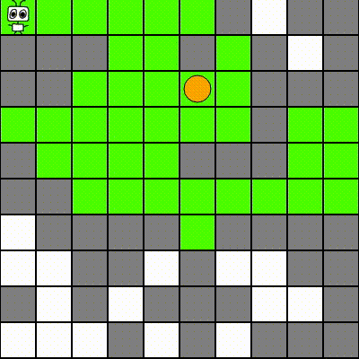

# AIXIjs
AIXIjs is a JavaScript demo for running General Reinforcement Learning (RL) agents in the browser. In particular, it provides a general and extensible framework for running experiments on Bayesian RL agents in general (partially observable, non-Markov, non-ergodic) environments.

**UPDATE** (May 2017): I'll be presenting a conference paper containing a literature survey along with some experiments based on AIXIjs at IJCAI 2017, in Melbourne, Australia. The paper (to appear) is: J. S. Aslanides, Jan Leike, and Marcus Hutter. "Universal Reinforcement Learning Algorithms: Survey & Experiments", in Proceedings of the 26th Intl. Joint Conf. on A.I..

 

## Features
Agents:
- Bayes (AIXI)
- KSA (Square, Shannon, and Kullback-Leibler)
- Thompson Sampling
- MDL Agent
- BayesExp
- (Tabular) QLearning/SARSA

Environments:
- Bandits
- Finite-state MDPs
- Gridworld POMDPs

See the [main site](http://aslanides.io/aixijs) for more background, documentation, references, and demos.

Note: AIXIjs uses some features from ECMAScript 2015 (ES6). It *should* work on recent versions of Firefox, Safari, Edge, and Chrome, but it's only really been tested on Chrome, so that's what I recommend using.

## API
There are a number of demos pre-made and ready to go; look at `src/demo.js` for examples. If you want to roll your own demo, here's an example of how to get a basic simulation working, with AIXI on a Dispenser Gridworld:

```javascript
let config = { /* ... */ }; // environment config; see src/config.js for examples
let env = new Gridworld(config); // construct environment
let options = { /* ... */ }; // agent options; see src/config.js for examples
let agent = new BayesAgent(options); // construct agent
let trace = new BayesTrace(); // accumulator for performance and history

let a = null; // action
let e = env.generatePercept() // percept

// main loop
for (let t = 0; t < options.cycles; t+s+) {
	trace.log(agent, env, a, e); // log info to trace
	a = agent.selectAction(e); // agent computes its policy and selects an action
	env.perform(a); // pass this action to the environment and compute dynamics
	e = env.generatePercept(); // environment emits a percept
	agent.update(a, e); // agent learns from action and resulting percept
}
// now do what you want with the trace -- it has logged all the relevant data
//
```

Note that agents should implement two methods, `selectAction(e)` and `update(a,e)`. Environments should implement `generatePercept()`, `perform(a)`, and `conditionalDistribution(e)`.

## How to run experiments

I've provided a helper function `demo.experiment(...configs,runs)` to make it easy to do numerous runs with different configs, and serialize the results to JSON. To run experiments, bring up the console in Chrome (Ctrl+Shift+I on Linux), and run something like:


After the experiments  download link for `results.json` will appear at the bottom of the DOM. See `src/demo.js:209` for details about the structure of the serialization. There's an iPython notebook in `experiments/analysis.ipynb` that should help get you started in producing plots etc.

## License
GPL.

## How to cite

If you use this software in your own experiments, please cite it as:

```
@inproceedings{ALH2017,
 author = {Aslanides, John and Leike, Jan and Hutter, Marcus},
 title = {Universal Reinforcement Learning Algorithms: Survey and Experiments},
 booktitle = {Proceedings of the Twenty-Sixth International Joint Conference on Artificial Intelligence},
 series = {IJCAI'17},
 year = {2017},
 publisher = {AAAI Press},
}
```

## Contributing

If you'd like to contribute, I'm all ears! There's a lot of stuff to do :) Go ahead and open a pull request!
